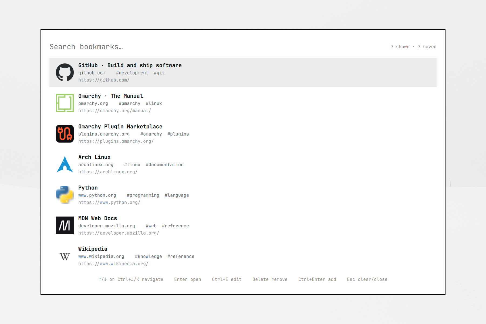
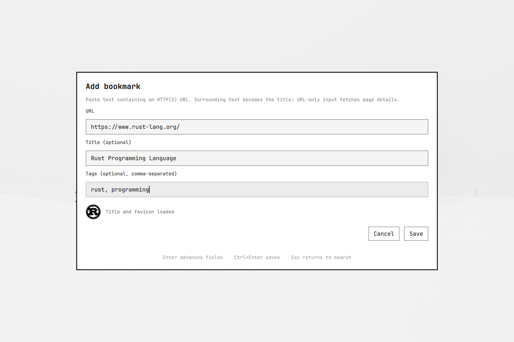

# Local Bookmarks

A resident bookmark search and capture overlay for Omarchy Quattro. The plugin loads once with `omarchy-shell`, searches local data in memory, opens URLs through an argv-safe `omarchy-launch-browser` call, and stores bookmarks as portable JSON.

## Preview

Search a local bookmark library with real site favicons:



Capture a URL, review fetched page details, and add optional tags:



## Features

- Search title, URL, derived domain, and tags while typing.
- Weighted exact, prefix, and substring ranking with bounded recency tie-breaking.
- At most 60 rendered results; no disk query or subprocess per keystroke.
- Add an HTTP(S) URL with an optional editable title and comma-separated tags.
- Extract the first HTTP(S) URL from pasted text and use surrounding text as the title, including legacy `Title | URL` entries.
- For URL-only input, fetch the Open Graph or HTML title and fall back to the URL host.
- Fetch and privately cache supported favicons for local-only rendering in search results.
- Edit title, URL, and tags with duplicate validation; changing URL refreshes metadata.
- Delete from search or edit mode, after a named confirmation.
- Detect duplicate URLs without rewriting the stored path, query, or fragment.
- Watch atomic external updates to bookmark and recent-state files.
- Keep malformed or unsupported bookmark data read-only and show the error in the overlay.
- Run without a helper daemon, second Quickshell process, runtime database, package manager, or install hook.

Folders, remote sync, notes, bulk operations, JavaScript-rendered metadata, authenticated metadata requests, and sharing are intentionally out of scope.

## Requirements

Runtime dependencies are limited to:

- Omarchy Quattro with manifest schema 1 and Quickshell;
- a POSIX shell and coreutils (`install`, `chmod`, `wc`, and `head`) for private storage and bounded reads;
- `omarchy-launch-browser` for opening URLs;
- Python 3 for bounded, one-shot page metadata/cache operations and the optional legacy importer;
- ImageMagick 7 (`magick`) for resource-limited raster favicon decoding and normalization;
- optionally, librsvg's `rsvg-convert` for SVG favicon candidates. SVG icons remain unavailable when it is absent.

There is no package-manager or third-party Python dependency.

## Install

```sh
omarchy plugin add https://github.com/idr4n/omarchy-bookmarks.git --enable --yes
```

The plugin ID is `io.github.idr4n.bookmarks`.

## Commands and keybindings

Search toggles the overlay. Invoking it again while visible hides it:

```sh
omarchy-shell shell toggle io.github.idr4n.bookmarks '{}'
```

Add opens the overlay directly in capture mode, or switches an already-open search overlay into capture mode:

```sh
omarchy-shell shell summon io.github.idr4n.bookmarks '{"mode":"add"}'
```

The plugin does not install keybindings. Recommended bindings are:

| Key | Command |
| --- | --- |
| `Ctrl+Alt+Space` | search toggle command above |
| `Ctrl+Alt+B` | add summon command above |

Search controls:

- `Up` / `Down` or `Ctrl+K` / `Ctrl+J`: select a result
- `Enter`: open the selected bookmark
- `Ctrl+E`: edit the selected bookmark
- `Delete`: confirm removal of the selected bookmark
- `Ctrl+Enter`: switch to add mode
- `Escape`: clear a non-empty query, then close
- Pointer click: select and open a result

Add and edit controls:

- Paste text anywhere in the URL field; the first HTTP(S) URL is extracted
- `Ctrl+Enter`: save immediately; any in-flight metadata fetch is cancelled, and an empty title falls back to the URL host
- `Delete…` in edit mode: open per-entry confirmation
- `Escape`: dismiss confirmation, then return to search

### Disable compositor animation

The layer-shell namespace is `idr4n-bookmarks`. Add a matching rule to the active Hyprland configuration so compositor fades do not mask the fast open path:

```ini
layerrule {
    name = no-anim-idr4n-bookmarks
    match:namespace = idr4n-bookmarks
    no_anim = true
    animation = none
}
```

Omarchy Lua configurations can express the same rule as:

```lua
hl.layer_rule({
  name = "no-anim-idr4n-bookmarks",
  match = { namespace = "idr4n-bookmarks" },
  no_anim = true,
  animation = "none",
})
```

## Data, privacy, and permissions

Bookmarks, cached favicons, and recency are deliberately separate:

```text
${XDG_DATA_HOME:-$HOME/.local/share}/io.github.idr4n.bookmarks/bookmarks.json
${XDG_DATA_HOME:-$HOME/.local/share}/io.github.idr4n.bookmarks/favicons-v2/
${XDG_DATA_HOME:-$HOME/.local/share}/io.github.idr4n.bookmarks/favicons/  # legacy, migration only
${XDG_STATE_HOME:-$HOME/.local/state}/io.github.idr4n.bookmarks/recent.json
```

Data/state/cache directories use mode `0700`; JSON and cached favicon files use mode `0600`. Plugin writes reapply private file modes. Mutable data is never stored in the installed Git checkout. Storage initialization failures are visible errors and never trigger privilege escalation or a fallback to a packaged path.

Search, opening, and usage tracking send nothing over the network. Entering a valid URL in add mode—or changing it in edit mode—starts one Python helper. It has a shared five-second request budget, follows at most three HTTP redirects, reads at most 1 MiB of HTML and 256 KiB per icon candidate, and accepts only HTTP(S). Every redirect hop is resolved separately, private or otherwise non-global addresses are discarded, and the connection is pinned to one validated numeric address while retaining the original host for HTTP and TLS. Proxy environment variables are not used.

The helper prefers scalable, explicitly large, and touch-icon candidates over small document-order favicons. PNG/JPEG/GIF/ICO/WebP candidates are decoded as a forced input format and first frame in a resource-limited ImageMagick subprocess, resized to at most 128 pixels, stripped, and re-encoded as a static PNG. SVG candidates receive equivalent process limits through `rsvg-convert` when available. Only validated normalized PNGs enter `favicons-v2/`; legacy `favicons/` bytes are never rendered. The helper sends no browser cookies, credentials, or bookmark collection, never bypasses invalid TLS or authentication, and never queries a third-party favicon service. Metadata failure is visible but never blocks saving a valid bookmark. Pasted title text remains authoritative. QML and CLI collectors stop helpers whose stdout or stderr exceeds 64 KiB.

`bookmarks.json` is limited to 1 MiB, 5,000 bookmarks, and JSON depth 32. Per record: IDs are at most 128 Unicode code points, titles 512, URLs 2,048, and tags 32 values of at most 64 each. `recent.json` is limited to 64 KiB and contains at most ten bookmark IDs, newest first. Files that exceed these limits are rejected before parsing and never overwritten. Deletion removes its recency entry and unreferenced cached favicon; cancellation also cleans an unreferenced fetched icon.

Back up `bookmarks.json` as ordinary portable user data. Include `favicons-v2/` only if you want to preserve the optional normalized cache. Keep `favicons/` only until legacy cache migration is complete. Treat `recent.json` as disposable local application state.

### Multi-machine sync

With Syncthing, share the plugin data directory itself on every machine:

```text
${XDG_DATA_HOME:-$HOME/.local/share}/io.github.idr4n.bookmarks/
```

This keeps `bookmarks.json` and its deterministic `favicons-v2/` cache together while leaving device-local `recent.json` unsynced. Use the same Syncthing folder ID and the corresponding local data path on each device; enable versioning on every receiving device. Do not move the data file into another synced tree and symlink it back—the plugin deliberately rejects mutable-data symlinks.

Atomic replacements are Syncthing-friendly, but `bookmarks.json` is still one file rather than a record-level sync protocol. Avoid editing bookmarks on two disconnected machines at the same time. If Syncthing creates a `.sync-conflict-*.json` file, preserve both copies and merge them deliberately; the plugin never guesses which concurrent edit should win.

## Legacy migration

`bookmarkctl` imports a UTF-8 line file whose first HTTP(S) URL is the destination, standalone `#tag` tokens are tags, and remaining text becomes the title. It leaves the source untouched.

Review a dry run first:

```sh
./bookmarkctl import-legacy /path/to/legacy-bookmarks --dry-run
```

Import into the default XDG data path:

```sh
./bookmarkctl import-legacy /path/to/legacy-bookmarks
```

If the plugin already initialized an empty schema-1 document, or when merging into an existing valid document, opt in explicitly:

```sh
./bookmarkctl import-legacy /path/to/legacy-bookmarks --merge
```

Use `--data-file PATH` to select another destination. Legacy input is capped at 4 MiB; the destination uses the same 1 MiB, 5,000-record, depth, and field limits as the overlay. Writes use a same-directory temporary file, `fsync`, atomic replacement, and private permissions. Malformed source rows refuse the write. Output is aggregate-only; it reports line numbers only for ambiguous multiple-URL rows.

Older releases stored downloaded bytes directly in `favicons/`. Those paths remain schema-compatible but are not rendered. Normalize them offline before using the cache:

```sh
./bookmarkctl normalize-favicons --dry-run
./bookmarkctl normalize-favicons
```

Normalization uses the bounded ImageMagick decoder, writes only static PNGs under `favicons-v2/`, atomically updates matching records, and deletes an old file only after it is unreferenced. It performs no network requests. Use `--limit N` for a smaller batch.

Legacy import stays offline, so imported rows initially have no favicon. After explicitly approving network access, inspect and backfill missing or unnormalized legacy favicons:

```sh
./bookmarkctl backfill-favicons --dry-run
./bookmarkctl backfill-favicons --workers 4
```

Backfill runs independently of the resident overlay, uses at most eight concurrent workers, and gives each bookmark one five-second budget shared by its page and icon requests. Successful icons are checkpointed atomically in batches while failed sites remain unchanged, so the command is safe to rerun. It never replaces titles or existing normalized favicons. Use `--limit N` for a smaller batch. `Ctrl+C` cancels queued requests, checkpoints results already collected by the command, and exits after at most the already-running workers finish.

To replace older low-resolution cache entries without degrading working icons:

```sh
./bookmarkctl refresh-favicons --dry-run
./bookmarkctl refresh-favicons --workers 4
```

Refresh downloads normalized icons into a private temporary directory, measures both safe PNGs, and installs a result only when it is larger than the currently referenced normalized icon or the old file is missing or legacy. New files use a URL-and-content-derived name so the running shell sees a changed source path; the old file is removed only after the JSON update succeeds and nothing references it. Titles, URLs, tags, timestamps, unknown fields, and failed fetches remain unchanged.

Avoid saving bookmark edits in the overlay while backfill or refresh is active. Both writers make valid atomic whole-file replacements and the command reloads current data before each checkpoint, but they do not share an interprocess lock; a save in the checkpoint's final read/write window can win or lose as one whole file.

## Development validation

This section is for contributors and release checks. Installed users do not need to run these commands.

From the repository root:

```sh
node tests/bookmark-model.js
python3 -m unittest discover -s tests -v
qmllint scripts/test/storage-boundary.qml scripts/test/fileview-cache.qml scripts/test/favicon-visibility.qml
marker="$(mktemp)"
BENCHMARK_RESULT="$marker" timeout 30 qs -p scripts/bench/shell.qml || test "$?" -eq 124
test "$(cat "$marker")" = PASS
rm -f "$marker"
omarchy plugin validate .
qmllint -I "$OMARCHY_PATH/shell" Bookmarks.qml
jq -e '.license == "MIT" and .homepage == "https://github.com/idr4n/omarchy-bookmarks"' manifest.json
```

The Quickshell benchmark reports 350-row and 5,000-row results separately. Its release budget is under 150 ms for 5,000-row parse plus index construction and under 16 ms for a matching search and sort on the target workstation.

JSON is intentionally bounded at 5,000 records and 1 MiB. Reconsider a precomputed or incremental index if a Quickshell-engine cold load approaches 50 ms on supported hardware. Benchmark SQLite/FTS only if simpler indexing changes cannot keep the real query path within one 16 ms frame.

## Disable, update, and remove

```sh
omarchy plugin disable io.github.idr4n.bookmarks
omarchy plugin enable io.github.idr4n.bookmarks
omarchy plugin update io.github.idr4n.bookmarks --yes
omarchy plugin remove io.github.idr4n.bookmarks --yes
```

Removal deletes the installed plugin source. It intentionally retains the XDG bookmark data, favicon cache, and recent state; delete those paths separately only when you intend to delete your bookmarks, cached icons, and recent history.

## License

MIT. See [LICENSE](LICENSE).

Third-party website names and favicons shown in the preview images remain the property of their respective owners and are included only as bookmark-rendering examples.
